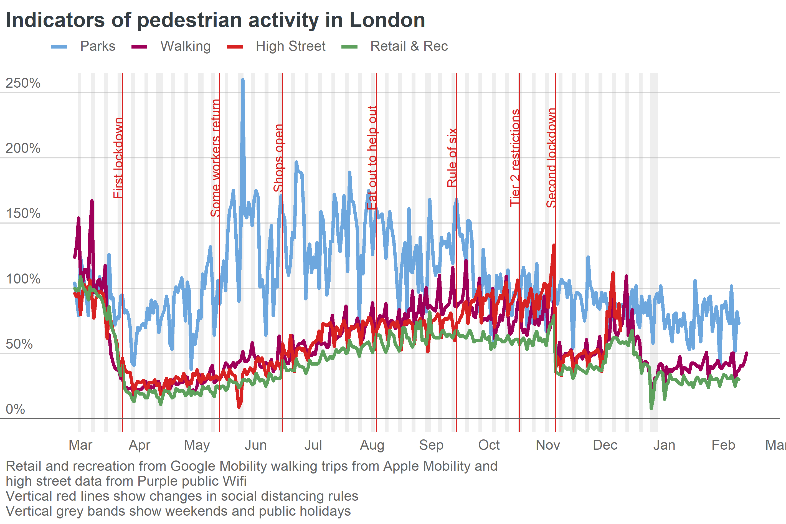

## Exploring Predictors of COVID Crime Shifts
The lockdown and social distancing measures that were brought in throughout the world to tackle COVID in 2020 have had a significant, widespread effect on crime. In this notebook, I use public London crime data on robbery and burglary to examine where this "COVID crime shift" was strongest, and whether any specific drivers or correlates can be identified.  

Our findings suggest that the relative change in burglary and robbery trends during "lockdown" in April and May 2020 was heavily affected by local characteristics: areas with a high residential population saw teh sharpest decreases in burglary (likely due to a reduction in available targets) while the reduction in robberies instead seem to be driven by geographic features and proxy indicators of deprivation (potentially suggesting more available targets for robbery in communities least able to work for from).

The primary purpose of this exercise was to learn R - I've previously worked entirely in Python, which is more than sufficient 99% of the time, but has at times proved a blocker when I want to tackle some more experimental geospatial methods or tools geared towards the academic community.  With that in mind, this is likely to be a little messy, and I'll aim to condense my main lessons into a blog post in the future. The models are not heavily tuned (aiming to explore correlates rather than provide accurate predictions) and certain predictors are likely to correlate with each other, and as such likely do not imply direct causations.

#### Resources I've used
- Matt Ashby Crime Mapping course: https://github.com/mpjashby/crimemapping/
- Spatial Modelling for Data Scientists: https://gdsl-ul.github.io/san/
- R for Data Science: https://r4ds.had.co.nz/index.html
- Geocomputation with R: https://geocompr.robinlovelace.net/


### Tasks

1. Ingest burglary and robbery data and assign to MSOA
2. Predict trend by MSOA
3. Identify COVID effect/error by MSOA
4. Model

### Data
In this exercise, I'm using three years of Metropolitan Police Service data from data.police.uk - I've downloaded these manually rather than using their API.

## 1. Ingest burglary and robbery data and assign to MSOA
Unlike Python has the benefit of being "focused" - it's primaryily a tool for academics/scientists, rather than a programming language. That means the eco-system is refreshingly helpful: at first glance, there is one primary IDE, one package library, and it all works. Unlike Python, most libraries are imported globally, and that works okay...*mostly*

[MSOAs are geographical units specifically designed for analysis, and to be comparable: they all have an average population of just over 8,000.](https://www.ons.gov.uk/methodology/geography/ukgeographies/censusgeography#output-area-oa)

```{r, results='hide'}
# Data manipulation, transformation and visualisation
library(tidyverse)
# Nice tables
library(kableExtra)
# Simple features (a standardised way to encode vector data ie. points, lines, polygons)
library(sf) 
# Spatial objects conversion
library(sp) 
# Thematic maps
library(tmap) 
# Colour palettes
library(RColorBrewer) 
# More colour palettes
library(viridis)
#ggplot organiastion
library(ggpubr)


library(raster)  # raster data
library(rgdal)  # input/output, projections
library(rgeos)  # geometry ops
library(spdep)  # spatial dependence

library(lubridate) #date and time

#random forest and metrics
library(Metrics)
library(caret)
library(randomForest)
require(caTools)
library(DALEX)
library(dplyr)


#correlation matrix
library(corrr)


```

Importing data from CSV files behaves quite similarly to Python. To build our process, we'll start by taking one month of crime data, exploring it, and writing all our steps for automation.

```{r}
test_df <- read.csv("crimes/2018-01/2018-01-metropolitan-street.csv")
test_df

```
Our crime is categories according to the Home Office major crime types, and like Python, we can list them all through the "unique" function. Here I'll be focusing on robbery and burglary: two crime types that are heavily reliant on encountering victim's in public spaces, and as such should be affected by the "COVID effect".

```{r}
unique(test_df["Crime.type"])
```
To avoid this getting particularly computationally intensive, let's write a function to pull out robberies and burglaries, and assign them a specific MSOA. Then we can iterate over all our months and get monthly counts for each offence type.

```{r}
subset_df <- filter(test_df, Crime.type=="Burglary" | Crime.type=="Robbery")
subset_df
```
Our single month of data contains 10,501 crimes.

There are R/Python quirks that will take some getting used to. While in Python, most columns can be referenced through their string name (["name"]), R seems somewhat fussier. Other than that, the move from one to another is largely intuitive.

We now need to link this to our spatial data. We use the MSOA borders provided by MOPAC, and use the UK National Grid coordinate system. Police.uk does not use that system, so we'll need to reproject our crime data.

```{r}
lsoa_borders <- st_read("msoa_borders/MSOA_2011_London_gen_MHW.tab", crs=27700)
lsoa_borders

```
Unlike our previous dataframes, this isn't "tidy" (due to a slightly different format containing geographical data)

```{r}
plot(lsoa_borders)
```
Before we can link our crimes to MSOA, we'll need to ensure identical coordinate systems, but before we do that, we'll need to erase any missing values.


```{r}
#count missing values in the longitude column
sum(is.na(subset_df["Longitude"]))
```

As such, we have 82 crimes with no geographic identifiers, which we remove from our analysis.

```{r}
clean_df <- subset_df[!rowSums(is.na(subset_df["Longitude"])), ]
clean_df
```
We can now convert our crime data to spacial data, using our longitude and latitude coordinates - this allows us to quickly plot our data, and confirm it looks right.

```{r}

subset_spatial <- st_as_sf(clean_df, coords = c("Longitude", "Latitude"), 
                      crs = 4326, remove = FALSE)

subset_spatial
```


```{r}
plot(subset_spatial)
```
Success! That looks faintly promising.  Now, let's figure out how to re-project.

```{r}

latlong = "+init=epsg:4326"
ukgrid = "+init=epsg:27700"

```

```{r}
subset_osgb <- st_transform(subset_spatial, ukgrid)
subset_osgb
```

We now run a "spatial join": assigning an MSOA to each of our crimes, based on the MSOA border map they are within, and combining these as one table.

```{r}
crime_with_msoa <- st_join(subset_osgb, lsoa_borders["MSOA11CD"])
crime_with_msoa
```
That has worked: each crime is now assigned to an MSOA. We can now group our table by count of MSOA, to obtain the monthly count of

```{r}
msoa_list<- crime_with_msoa %>%
  group_by(MSOA11CD, Crime.type) %>%
  summarize(count_by_msoa = n())

msoa_list
```
We now have a count for each, and we can remove the geometry data before automating our process.

```{r}
msoa_pivot_tibble <- as_tibble(msoa_list)
msoa_pivot_tibble <- msoa_pivot_tibble[0:3]
msoa_pivot_tibble

```

As a final stage prior to processing the rest of our data, we will fill any missing msoa/month combinations with a "0", to ensure consistent trends.

```{r}
#creating a df with all msoa names, for robbery and burglary
msoa_zero_df_robbery <- unique(as_tibble(lsoa_borders)["MSOA11CD"])
msoa_zero_df_burglary <- unique(as_tibble(lsoa_borders)["MSOA11CD"])

#adding our crime type column 
msoa_zero_df_burglary["Crime.type"] = "Burglary"
msoa_zero_df_robbery["Crime.type"] = "Robbery"

#Creating a "count" column identical to our pivot, and filling it with 0
msoa_zero_df_burglary["count_by_msoa"] = as.numeric(0)
msoa_zero_df_robbery["count_by_msoa"] = as.numeric(0)

#combine both
duplicate_concat <- rbind(msoa_zero_df_robbery, msoa_zero_df_burglary)

#add our duplicates to our original table
df_with_dups <- rbind(msoa_pivot_tibble, duplicate_concat)


#creating a filter for duplicates columns, which should ignore the first instance
dup_filters <- duplicated(df_with_dups[0:2])


#bring it all back together
monthly_df <- filter(df_with_dups, !dup_filters)
monthly_df

#select the first unique value of months in the original dataframe
month <- unique(test_df["Month"])[1,1]
monthly_df["Month"] <- month
monthly_df

```
we now have our basic functionality to create a time series for both crime types, by MSOA - a count of each type, and the month. 

I can now bring all my previous work together into a function, which we can use to automate the process.

```{r}
#quick initial function to generate our MSOA borde spatial frame, to avoid it sitting in the initial frame and gobbling loads of memory.
generate_msoa_borders <- function(file){
  msoa_borders <- st_read(file, crs=27700)
  return(msoa_borders)
}

make_month_pivot <- function(file){
  #define our CRS
  latlong = "+init=epsg:4326"
  ukgrid = "+init=epsg:27700"
  #read our crime from the file
  test_df <- read.csv(file)
  #select only our target crime types
  subset_df <- filter(test_df, Crime.type=="Burglary" | Crime.type=="Robbery")
  #remove any rows with a long/lat coordinate
  clean_df <- subset_df[!rowSums(is.na(subset_df["Longitude"])), ]
  #generate a spatial df
  subset_spatial <- st_as_sf(clean_df, coords = c("Longitude", "Latitude"), 
                      crs = 4326, remove = FALSE)
  #reproject to uk grid coords
  subset_osgb <- st_transform(subset_spatial, ukgrid)
  #spatially join to assign to an MSOA
  crime_with_msoa <- st_join(subset_osgb, msoa_borders["MSOA11CD"])
  #summarise by count of MSOA
  msoa_list<- crime_with_msoa %>%
    group_by(MSOA11CD, Crime.type) %>%
    summarize(count_by_msoa = n())
  #return to a non-geographic msoa
  msoa_pivot_tibble <- as_tibble(msoa_list)
  msoa_pivot_tibble <- msoa_pivot_tibble[0:3]
  #creating a df with all msoa names, for robbery and burglary
  msoa_zero_df_robbery <- unique(as_tibble(msoa_borders)["MSOA11CD"])
  msoa_zero_df_burglary <- unique(as_tibble(msoa_borders)["MSOA11CD"])
  #adding our crime type column 
  msoa_zero_df_burglary["Crime.type"] = "Burglary"
  msoa_zero_df_robbery["Crime.type"] = "Robbery"
  #Creating a "count" column identical to our pivot, and filling it with 0
  msoa_zero_df_burglary["count_by_msoa"] = as.numeric(0)
  msoa_zero_df_robbery["count_by_msoa"] = as.numeric(0)
  duplicate_concat <- rbind(msoa_zero_df_robbery, msoa_zero_df_burglary)
  df_with_dups <- rbind(msoa_pivot_tibble, duplicate_concat)
  #creating a filter for duplicates columns, which should ignore the first instance
  dup_filters <- duplicated(df_with_dups[0:2])
  monthly_df <- filter(df_with_dups, !dup_filters)
  #re-add our month column
  month <- unique(test_df["Month"])[1,1]
  monthly_df["Month"] <- month
  return(monthly_df)
}
```

We now have a rudimentary tooling pipeline, which we can iterate over our subfolders to aggregate our data (in hindset, I probably should have explored the API options).

  
```{r, results='hide'}
#create empty dataframe to bring together our data
empty_df <- tibble(
MSOA11CD = "", 
Crime.type= "",
count_by_msoa= "",
Month= ""
)

#re-ingest our MSOA data
msoa_borders <- generate_msoa_borders("msoa_borders/MSOA_2011_London_gen_MHW.tab")
```

Our function will iterate over each file, add them to our empty table, until each is complete (and we have a single, aggregated file)

```{r, results='hide'}
subfiles <- list.files(path = "crimes", recursive=T)

for (file in subfiles){
  folder_subdir <- "crimes/"
  #concatenate to get our total subfolder directory - hacky but will work here.
  sub_path <- paste(folder_subdir, file, sep="")
  monthly_df <- make_month_pivot(sub_path)
  empty_df <- rbind(empty_df, monthly_df)
}

```


```{r}
empty_df
```
We now have a combined dataframe of 71,848 rows, from January 2018 through December 2020.

```{r}
unique(empty_df["Month"])
```
From a practical perspective, that was slightly more painful than I expected - I'm not sure if data-wrangling is less intuitive in R, or it's just practice, but it's noticeable how easy use cases are less easily accessible as tutorials (probably due to the different user base
)


```{r}
#saving file to CSV
#write.csv(empty_df,"msoa_crime_matrix.csv")

```


## 2. Predict trend by MSOA
#### Visualisation and Exploration
With our data now cleaned and aggregated, we can focus on the more interesting part - forecasting our "expected" pandemic crime, and examining how much it diverges from our "actual" crime.

```{r}
empty_df <- read.csv("msoa_crime_matrix.csv")
empty_df <- empty_df[2:70848,2:5]
empty_df
```


Before going any further, let's use this to explore and visualise the distribution of robbery and burglary across time and space during our "pre-pandemic" period, in March 2020 - based on London mobility indicators, this is when movement accross London began to be heavily affected, and the disruption was most notable in April



```{r}
burglary_df<-empty_df

#add a "1" so our month can be converted to a full date
burglary_df$DateString <- paste(burglary_df$Month, "-01", sep="")

#convert to date format
burglary_df$DateClean <- ymd(burglary_df$DateString)

#filter out only burglary prior to the pandemic
burglaryExplore <- filter(burglary_df,  DateClean < "2020-03-01" & Crime.type=="Burglary")

burglaryExplore
```


Looking at the aggregate counts of burglary across London, a visual observation suggests yearly trends (which we'll have to consider in our forecast), which sharp peaks during the Winter months and the lowest numbers in summer (when the days are longest).
```{r}
#group burglary count by months and plot
burglary_by_month <- burglaryExplore %>%
  group_by(DateClean) %>%
  summarize(total_burglaries = sum(count_by_msoa))

ggplot(burglary_by_month, aes(x=DateClean, y=total_burglaries)) +
  geom_line()
```

To observe how crime counts are distributed in space, let's map both counts by MSOA. As  previously mentioned, MSOAs are designed to be comparable units, at least from a population perspective - we don't need to produce per population rates. 


```{r, fig.width = 13}
burglary_by_msoa <- burglaryExplore %>%
  group_by(MSOA11CD) %>%
  summarize(total_burglaries = sum(count_by_msoa))

#we join our burglary counts to their geographic msoa
burglary_map <- left_join(lsoa_borders, burglary_by_msoa, by = "MSOA11CD")

#user brewer colour palette https://colorbrewer2.org
pal <- brewer.pal(5,"BuGn")

#create our map, and add the layout options
burglary_map <-tm_shape(burglary_map) +
  tm_fill(col = "total_burglaries", title = "Total Burglary Count by MSOA", style="quantile", palette="BuGn") +
  tm_layout(legend.outside = TRUE, legend.outside.position = "right")

robbery_df<-empty_df

robbery_df$DateString <- paste(robbery_df$Month, "-01", sep="")
robbery_df$DateClean <- ymd(robbery_df$DateString)
robberyExplore <- filter(robbery_df,  DateClean < "2020-03-01" & Crime.type=="Robbery")

robbery_by_msoa <- robberyExplore %>%
  group_by(MSOA11CD) %>%
  summarize(total_robberies = sum(count_by_msoa))

robbery_map <- left_join(lsoa_borders, robbery_by_msoa, by = "MSOA11CD")

pal <- brewer.pal(5,"BuGn")


robbery_map <-tm_shape(robbery_map) +
  tm_fill(col = "total_robberies", title = "Total Robbery Count by MSOA", style="quantile", palette="BuGn") +
  tm_layout(legend.outside = TRUE, legend.outside.position = "right")


#arrange the maps together
tmap_arrange(burglary_map, robbery_map, nrow = 2)
```

We notice that robbery is noticeably more concentrated in central London, with burglary remaining quite common across the city. That said, there are also obvious spatial patterns here - these crimes are clustered in certain geographies. 

#### Modelling 
We can now begin the forecasting process. To design our process, we'll start by focusing on a single MSOA - the first in our dataset, [E02000001, or the City of London.](https://findthatpostcode.uk/areas/E02000001.html)

```{r}
single_msoa_df <- filter(empty_df, MSOA11CD == "E02000001" & Crime.type=="Burglary")

#we add a 01 to our date to ensure R recognises the date format
single_msoa_df$DateString <- paste(single_msoa_df$Month, "-01")


single_msoa_df$DateClean <- ymd(single_msoa_df$DateString)
single_msoa_df
```
From a forecasting/time-series perspective, this is a very small dataset - 36 monthly observations. We will be shrinking this further to only 26 by focusing on data prior to March 2020, when the COVID crime impact is felt. This significantly limits our forecasting options, and will impact accuracy, if we treat each MSOA in isolation - we could explore some sort of Vector Autoregressive Model to limit this, but given that we're then going to be exploring the error of all our models in aggregation, this isn't crucial. Our focus is on models that we can accurately deploy without needing to tune each of them individually, and that can capture the seasonal trend, and generate reliable predictions on our limited dataset. 

Given these limitations, I've opted for [the Prophet algorith.](https://facebook.github.io/prophet/) While it's more opaque than a auto-arima or VAR model, it works well with monthly data, and extracting seasonal trends. It also requires very little tuning.

As such, we'll extract our "training set" prior to March, and start forecasting.

```{r}

training_set <- filter(single_msoa_df, DateClean < "2020-03-01")

training_df <- tibble(
  ds=training_set$DateClean,
  y=training_set$count_by_msoa
)
training_df
```

```{r, results='hide'}
library(prophet)
m <- prophet(training_df)

```
For now, we'll forecast on a 6 month horizon - we obviously wouldn't expect it to be accurate that far into the future.

```{r}
#prophet generates a future dataframe using our data, for 6 mperiods
future <- make_future_dataframe(m, periods = 6, freq = 'month')


forecast <- predict(m, future)

plot(m, forecast)

```
As we can see, the model seems consistent on a short horizon, and gets very wide as it goes further into the future. More importantly however, it has extracted a yearly seasonal compontent - the summer decrease we identified previously - as well as a long term trend.  

```{r}

prophet_plot_components(m, forecast)
```
These predictions seem far-fetched, but remember we will be observing a London wide error rate. As such, we must now isolate our "pandemic period" - which we define as April and May 2020 - and compare the predicted crime counts to the actual crime counts to obtain a metric of our "COVID crime shift", or our error rate.

```{r}


forecast$Month <- month(forecast$ds)
forecast$Year <- year(forecast$ds)


this_year <- filter(forecast, Year > 2019)
peak_pandemic <- filter(this_year, Month== 4 | Month== 5 )

predictionPivot <- peak_pandemic %>%
  group_by(Month) %>%
  summarize(predicted_burglary = mean(yhat))


single_msoa_df$MonthNum <- month(single_msoa_df$DateClean)
single_msoa_df$YearNum <- year(single_msoa_df$DateClean)

this_year_actual <- filter(single_msoa_df, YearNum > 2019)
peak_pandemic_actual <- filter(this_year_actual, MonthNum== 4 | MonthNum== 5 )

actual_burglary <- sum(peak_pandemic_actual$count_by_msoa)
pred_burglary <- sum(predictionPivot$predicted_burglary)

error <- actual_burglary - pred_burglary
percentage_error <- error / pred_burglary 

print("Burglary Count")
print(actual_burglary)
print("Predicted")
print(pred_burglary)

print("Actual Error")
print(error)
print("Percentage Error")
print(percentage_error)
```
In this MSOA, our model predicted nearly 8 burglaries would occur in these two months, based on pre-pandemic trends. In reality, 1 took place - a large error rate, suggesting a strong "COVID effect".

This process can now be replicated for every MSOA in London, to obtain this metric for each MSOA.

```{r, results='hide'}


msoa_error_tibble <- tibble(
MSOA11CD = "", 
burglaryActual= "",
burglaryPredicted= "",
burglaryError= "",
burglaryPercentError="",
robberyActual= "",
robberyPredicted= "",
robberyError= "",
robberyPercentError=""
)

calculate_error <- function(msoaName){
  #select only burglary and our msoa
  single_msoa_df <- filter(empty_df, MSOA11CD == msoaName & Crime.type=="Burglary")
  #clean date date
  single_msoa_df$DateString <- paste(single_msoa_df$Month, "-01")
  single_msoa_df$DateClean <- ymd(single_msoa_df$DateString)
  #generate training set up until March
  training_set <- filter(single_msoa_df, DateClean < "2020-03-01")
  #prepare for Prophet
  training_df <- tibble(
    ds=training_set$DateClean,
    y=training_set$count_by_msoa)
  #start and predict prophet for 6 months
  m <- prophet(training_df)
  future <- make_future_dataframe(m, periods = 6, freq = 'month')
  forecast <- predict(m, future)
  forecast$Month <- month(forecast$ds)
  forecast$Year <- year(forecast$ds)
  #aggregate forecasts and actual crime
  this_year <- filter(forecast, Year > 2019)
  peak_pandemic <- filter(this_year, Month== 4 | Month== 5 )
  predictionPivot <- peak_pandemic %>%
    group_by(Month) %>%
    summarize(predicted_burglary = mean(yhat))

  single_msoa_df$MonthNum <- month(single_msoa_df$DateClean)
  single_msoa_df$YearNum <- year(single_msoa_df$DateClean)
  #generate error rates
  this_year_actual <- filter(single_msoa_df, YearNum > 2019)
  peak_pandemic_actual <- filter(this_year_actual, MonthNum== 4 | MonthNum== 5 )
  actual_burglary <- sum(peak_pandemic_actual$count_by_msoa)
  pred_burglary <- sum(predictionPivot$predicted_burglary)
  error_burg <- actual_burglary - pred_burglary
  percentage_error_burg <- error_burg / pred_burglary 
  
  #now repeat for robbery
  
  single_msoa_df <- filter(empty_df, MSOA11CD == msoaName & Crime.type=="Robbery")
  single_msoa_df$DateString <- paste(single_msoa_df$Month, "-01")
  single_msoa_df$DateClean <- ymd(single_msoa_df$DateString)
  training_set <- filter(single_msoa_df, DateClean < "2020-03-01")
  training_df <- tibble(
    ds=training_set$DateClean,
    y=training_set$count_by_msoa)
  m <- prophet(training_df)
  future <- make_future_dataframe(m, periods = 6, freq = 'month')
  forecast <- predict(m, future)
  forecast$Month <- month(forecast$ds)
  forecast$Year <- year(forecast$ds)
  this_year <- filter(forecast, Year > 2019)
  peak_pandemic <- filter(this_year, Month== 4 | Month== 5 )
  predictionPivot <- peak_pandemic %>%
    group_by(Month) %>%
    summarize(predicted_burglary = mean(yhat))

  single_msoa_df$MonthNum <- month(single_msoa_df$DateClean)
  single_msoa_df$YearNum <- year(single_msoa_df$DateClean)

  this_year_actual <- filter(single_msoa_df, YearNum > 2019)
  peak_pandemic_actual <- filter(this_year_actual, MonthNum== 4 | MonthNum== 5 )
  actual_robbery <- sum(peak_pandemic_actual$count_by_msoa)
  pred_robbery <- sum(predictionPivot$predicted_burglary)
  error_rob <- actual_robbery - pred_robbery
  percentage_error_rob <- error_rob / pred_robbery 
  
  #create our output dataframe and return it
  
  msoa_error_tibble <- tibble(
    MSOA11CD = msoaName, 
    burglaryActual= actual_burglary,
    burglaryPredicted= pred_burglary,
    burglaryError= error_burg,
    burglaryPercentError = percentage_error_burg,
    robberyActual= actual_robbery,
    robberyPredicted= pred_robbery,
    robberyError= error_rob,
    robberyPercentError=percentage_error_rob
    )

  return(msoa_error_tibble)
}

for (msoa in unique(empty_df$MSOA11CD)){
  iterated_msoa_df <- calculate_error(msoa)
  msoa_error_tibble <- rbind(msoa_error_tibble, iterated_msoa_df)
  
}


```


```{r}
msoa_error_tibble
```

Our process has completed: we have a "COVID shift" measure for all of London.

## 3. Measuring Local COVID Crime Shifts

We now need to use our forecasts to measure the "error" - this should provide an indication of the "COVID Crime Shift", or how much the actual crime diverted from the previous forecasts.

I explored various avenues for this: the ideal solution would be a relative rate of the error, as MSOAs with large crime numbers will likely generate large errors, and so a rate would be ideal, though this is complicated by our erratic prediction and mix of positive and negative numbers.

Our final solution has explored two options:
- the absolute error number
- the relative error once the crime and predictions have been transformed (by adding 50)

We visualise and describe these statistics first to ensure they appear sensible.


```{r}
#write_csv(msoa_error_tibble, "msoa_error_table2.csv")
```

```{r}
msoa_error_tibble <- read_csv("msoa_error_table2.csv")
#msoa_error_tibble<- msoa_error_table[2:980,]
msoa_error_tibble[,2:9] <- lapply(msoa_error_tibble[,2:9], as.numeric)

msoa_error_tibble <- msoa_error_tibble[2:980, ]

msoa_error_tibble <- left_join(msoa_error_tibble, robbery_by_msoa, by = "MSOA11CD")
msoa_error_tibble <- left_join(msoa_error_tibble, burglary_by_msoa, by = "MSOA11CD")


```


```{r}

msoa_error_tibble$RPDBurglary <- (msoa_error_tibble$burglaryActual - msoa_error_tibble$burglaryPredicted)/((msoa_error_tibble$burglaryPredicted + msoa_error_tibble$burglaryActual)/2)

msoa_error_tibble$RPDRobbery <- (msoa_error_tibble$robberyActual - msoa_error_tibble$robberyPredicted)/((msoa_error_tibble$robberyPredicted + msoa_error_tibble$robberyActual)/2)

msoa_error_tibble$robberyActualShifted <- msoa_error_tibble$robberyActual + 50
msoa_error_tibble$robberyPredictedShifted <- msoa_error_tibble$robberyPredicted + 50


msoa_error_tibble$RPDRobberyShifted <- (msoa_error_tibble$robberyActualShifted - msoa_error_tibble$robberyPredictedShifted)/((msoa_error_tibble$robberyPredictedShifted + msoa_error_tibble$robberyActualShifted)/2)

msoa_error_tibble$burglaryActualShifted <- msoa_error_tibble$burglaryActual + 50
msoa_error_tibble$burglaryPredictedShifted <- msoa_error_tibble$burglaryPredicted + 50


msoa_error_tibble$RPDburglaryShifted <- (msoa_error_tibble$burglaryActualShifted - msoa_error_tibble$burglaryPredictedShifted)/((msoa_error_tibble$burglaryPredictedShifted + msoa_error_tibble$burglaryActualShifted)/2)


```

```{r}
print("Burglary Error")
summary(msoa_error_tibble$burglaryError)
print("Burglary Relative Error")
summary(msoa_error_tibble$RPDburglaryShifted)
print("Robbery Error")
summary(msoa_error_tibble$robberyError)
print("Robbery Relative Error")
summary(msoa_error_tibble$RPDRobberyShifted)

```
As we can see, the average London MSOA experienced a negative COVID crime shift for both burglary and robbery, but this is far from equally distributed - at the extremes, some areas actually see large increases on our predicted values. 

```{r , fig.width = 13}

burg_hist <- ggplot(msoa_error_tibble, aes(x=burglaryError)) + geom_histogram()
rob_hist <-ggplot(msoa_error_tibble, aes(x=robberyError)) + geom_histogram()
burg_r_hist <- ggplot(msoa_error_tibble, aes(x=RPDburglaryShifted)) + geom_histogram()
rob_r_hist <- ggplot(msoa_error_tibble, aes(x=RPDRobberyShifted)) + geom_histogram()
scatter <- ggplot(msoa_error_tibble, aes(x = RPDRobberyShifted, y = RPDburglaryShifted)) +
  geom_point()

r_scatter <- ggplot(msoa_error_tibble, aes(x = robberyError, y = burglaryError)) +
  geom_point()

ggarrange(rob_hist, burg_hist, rob_r_hist, burg_r_hist,scatter, r_scatter, ncol=2, nrow=3 )


```
Our shifted relative error rate seems to function as intended: while there are still outliers, they are more concentrated than they are for the pure error term, and the overall distribution is more focused, while still indicating the direction and relative strength of our COVID effect.

Let's map this effect visually, and see if any particular areas stand out.

```{r , fig.width = 13}
#re-ingest our geographic MSOA borders
msoa_borders <- st_read("msoa_borders/MSOA_2011_London_gen_MHW.tab", crs=27700)

geographic_error_map <- left_join(msoa_borders, msoa_error_tibble, by = "MSOA11CD")

burg_map <- tm_shape(geographic_error_map) +
  tm_fill(col = "robberyError", title = "Robbery Error", palette="-PuOr")+
  tm_layout(legend.outside = TRUE, legend.outside.position = "right")
rob_map <-tm_shape(geographic_error_map) +
  tm_fill(col = "burglaryError", title = "Burglary  Error", palette="-PuOr")+
  tm_layout(legend.outside = TRUE, legend.outside.position = "right")


burg_map_rate <- tm_shape(geographic_error_map) +
  tm_fill(col = "RPDRobberyShifted", title = "Robbery Error Relative", palette="-PuOr")+
  tm_layout(legend.outside = TRUE, legend.outside.position = "right")
rob_map_rate <-tm_shape(geographic_error_map) +
  tm_fill(col = "RPDburglaryShifted", title = "Burglary  Error Relative", palette="-PuOr")+
  tm_layout(legend.outside = TRUE, legend.outside.position = "right")


tmap_arrange(burg_map, rob_map, burg_map_rate, rob_map_rate , nrow = 2, ncol=2)

```
It's hard to identify any obvious effect visually, but we do notice that while central London sees some very strong reductions, it also sees some increases.  Conversely, the outskirts of London (notably to the south and West) are a near continuous area of large decreases. The effect does vary by offence type, but the pattern seen in South and West London appears broadly consistent.

## 4. Identifying Correlates and Modelling

We've identified that the COVID crime effect was felt unequally accross London, and varies by offence type. To finalise our project, we will be linking our data to [demographic data provided by MOPAC](https://data.london.gov.uk/dataset/msoa-atlas), and aiming to use it to identify correlates to our "covid shift", and hopefully build models disentangling the effect.

```{r}
library(readxl)
#ingest ATLAS
msoa_atlas <- read_excel("msoa_atlas/msoa-data.xls")

#join by MSOA
geographic_msoa_matrix <- left_join(geographic_error_map, msoa_atlas, by = "MSOA11CD")

#convert to tibble
msoa_matrix_tbl <- as_tibble(geographic_msoa_matrix)
write_csv(msoa_matrix_tbl, "msoa_matrix.csv")


#select only numeric data
msoa_matrix_numeric <-dplyr::select_if(msoa_matrix_tbl, is.numeric)
msoa_matrix_numeric
```
Having now ingested and linked our data, we begin by exploring the factors most highly correlated with our relative error rates.

```{r, results='hide'}

corr_df <- correlate(dplyr::select_if(msoa_matrix_tbl, is.numeric), quiet = TRUE)

options(scipen=999)
```
Starting by our relative robbery error, a few interesting correlates stand out:
- road traffic casualties
- burglary numbers
- the number of dwellings with no usual residents, and the number of commercial residents
- households with no cars
- the age composition of the area
- general deprivation indicators (such as the proportion of households with central heating)

```{r}
#show only correlates with an absolute value higher than 0.2
#filter(dplyr::select(corr_df[order(corr_df$RPDRobberyShifted),] , term, RPDRobberyShifted), RPDRobberyShifted < -0.2 | RPDRobberyShifted > 0.2)
#filter(dplyr::select(corr_df[order(corr_df$RPDRobberyShifted),] , term, RPDRobberyShifted), RPDRobberyShifted < -0.2 | RPDRobberyShifted > 0.2)
high_corr_rob <- filter(dplyr::select(corr_df, term, RPDRobberyShifted), RPDRobberyShifted < -0.15 | RPDRobberyShifted > 0.15)

high_corr_rob[order(high_corr_rob$RPDRobberyShifted),]

```
The correlations for burglary are weaker - only a few have an absolute value higher than 0.2 - but a few stand out:
- households with no residents
- high robbery numbers
- house prices 

```{r}

high_corr_burg <- filter(dplyr::select(corr_df, term, RPDburglaryShifted), RPDburglaryShifted < -0.15 | RPDburglaryShifted > 0.15)

high_corr_burg[order(high_corr_burg$RPDburglaryShifted),]

```
These correlates suggest we can model this shift - this is likely to prove more reliable for robbery (where the correlations are stronger), and seem linked to usual resident population(as measured by household composition), deprivation (through various proxy indicators such as central heating presence or housing type), and general crime patterns (through total burglary and robbery numbers)

We will take two approaches for modelling: a simple regression (to identify strong links) and random forest regressors (to identify non-linear associations)

### Simple Regression

We begin through the use of simple OLS regression. This is a linear model that has large limitations for modelling complex relationships, but can be an effective first step, effectively with a few transformations.

R does not cope well with blank spaces in terms, so we'll extract and rename our key correlates.

```{r}

#make copy of df and rename 

msoa_copy <- msoa_matrix_numeric

names(msoa_copy)[names(msoa_copy) == "Dwelling type (2011) Household spaces with no usual residents"] <- "DwellingNoResidents"
names(msoa_copy)[names(msoa_copy) == "House Prices Median House Price (£) 2010"] <- "MedianHousePrice"
names(msoa_copy)[names(msoa_copy) == "Dwelling type (2011) Flat, maisonette or apartment"] <- "FlatAprt"
names(msoa_copy)[names(msoa_copy) == "Qualifications (2011 Census) Schoolchildren and full-time students: Age 18 and over"] <- "fullTimeStudents"
names(msoa_copy)[names(msoa_copy) == "Car or van availability (2011 Census) No cars or vans in household"] <- "NoCars"
names(msoa_copy)[names(msoa_copy) == "Ethnic Group (2011 Census) Other ethnic group"] <- "OtherEthnicGroup"
names(msoa_copy)[names(msoa_copy) == "Central Heating (2011 Census) Households with central heating (%)"] <- "CentralHealingPercent"


```
Let's now extract these to a separate dataframe, remove any missing values, and provide some quick summary statistics to identify any obvious concerns.

```{r}

feature_df <- dplyr::select(msoa_copy, RPDburglaryShifted, RPDRobberyShifted, total_burglaries, total_robberies, DwellingNoResidents, MedianHousePrice, FlatAprt, fullTimeStudents, NoCars, OtherEthnicGroup, CentralHealingPercent, AvHholdSz, ComEstRes)

feature_df <- drop_na(feature_df, RPDburglaryShifted, RPDRobberyShifted)
feature_df
```
```{r}
summary(feature_df)
```


```{r}

colSums(is.na(feature_df))
```
As a quick initial exercise, we'll create  a scatter plot of the interaction between each and every one of our variables. This will probably be too messy to make any real findings, but can serve to quickly highlight strong associations.

```{r, fig.width = 13}
pairs(feature_df)

```
As we hoped, some obvious relationships stand out: for instance, the presence of apartments, and households with no cars, or central heating and average household size.

Our robbery and burglary data and change rates are densely clustered - they're unlikely to cleanly associate with anything. With that in mind, we'll perform a log transformation. This cannot be undertaken with negative values, so once again we'll perform a shift (of 2) for both of our relative error numbers, as well as a commercial resident column, before log transforming our features.


```{r}
feature_df$BurglaryRPDTranform <- feature_df$RPDburglaryShifted    + 2
feature_df$RobberyRPDTranform <- feature_df$RPDRobberyShifted   + 2

feature_df$ComEstResTranform <- feature_df$ComEstRes   + 2


for (col in colnames(feature_df)){
  new_name <- paste("log_", col, sep = "")
  feature_df[new_name] <- log(feature_df[col])
}
```
```{r}

drop<- c( "log_ComEstRes", "log_RPDburglaryShifted", "log_RPDRobberyShifted")
feature_df<- feature_df[,!(names(feature_df) %in% drop)]


```


```{r}

feat_transform_df <- feature_df[,17:29]
orig_feat_df <- feature_df[,0:17]


```
We've now separated a separate dataframe where each value has been log transformed - while this isn't hugely rigorous (and would benefit from inspecting the relationships in more detail) it serves our immediate purpose.

```{r, fig.width = 13}
pairs(feat_transform_df)

```

While we've introduced a bit of noise, we've also "forced" some of our variables into relationships that look semi linear. 

To dig into this deeper, let's create a correlation matrix for our entire transformed dataframe.

```{r}
correlate(feat_transform_df)


```

To provide a visual aid, I've extracted the column for our robbery relative change rate, and sorted the table accordingly.


```{r}
dplyr::select(correlate(feat_transform_df)[order(correlate(feat_transform_df)$log_BurglaryRPDTranform),], term, log_BurglaryRPDTranform)
```
### Regression
Now that we've transformed our data, cleaned it up, and identified potential correlates, let's build our linear model. 

There are various automated tools for this process that seek to provide the highest fit and significance, but given the high degree of correlation between my chosen features, I've taken a more manual approach and tested a variety of models until I identified one with a suitable fit.  The final model is below.

```{r}
mod_burglary <- lm(log_BurglaryRPDTranform ~ log_total_burglaries + log_FlatAprt + log_MedianHousePrice  + log_ComEstResTranform, data = feat_transform_df)
summary(mod_burglary)
```

Our model suggests the largest burglary decrease linked to lockdown was in MSOAs which a high level of historic burglary. The composition of housing/accomodation and area type also seems to play a role, with those areas with higher median house prices, and a larger number of commercial residents, seeing stronger decreases, while conversely areas with large number of apartments temper the effect.

While all our variables are significant, the model is not a particularly good fit - the adjusted R2 is around 0.08, suggesting that less than 10% of the variance is accounted for by our model. I suspect more geographic features - such as distance from central London, more accurate footfall, or spatial lags - would probably be useful, but that's outside the scope of this project.

Let's perform a similar exercise for robbery.

```{r}
dplyr::select(correlate(feat_transform_df)[order(correlate(feat_transform_df)$log_RobberyRPDTranform),], term, log_RobberyRPDTranform)
```


```{r}
mod_burglary <- lm(log_RobberyRPDTranform ~ log_total_robberies  + log_total_burglaries + log_FlatAprt + log_CentralHealingPercent + log_fullTimeStudents, data = feat_transform_df)
summary(mod_burglary)
```

This is a notably better fit than our burglary model, with our R2 suggesting we now account for over 20% of the variance. The nature of our predictors is also quite different: while we still see a negative relationship with historic crime (with areas of high historic crime experiencing larger relative decreases), there is a positive relationship with both the presence of apartments and central heating.

I suspect some of these features are correlates of deprivation, so I want to create a quick scatter of three - for now we'll do it against median house price, which is definitely deprivation correlated.

```{r}

heating <- ggplot(feature_df, aes(x = log_MedianHousePrice, y = log_CentralHealingPercent)) +
  geom_point()+
  geom_smooth(method=lm)

apartments <- ggplot(feature_df, aes(x = log_MedianHousePrice, y = log_FlatAprt)) +
  geom_point()+
  geom_smooth(method=lm)

comest <- ggplot(feature_df, aes(x = log_MedianHousePrice, y = log_ComEstResTranform)) +
  geom_point()+
  geom_smooth(method=lm)


ggarrange(heating, apartments, comest, ncol=3, nrow=1 )


```

While there does appear to be a relationship with some of these, it isn't strong - this suggests the factor's we have identified are significant not because of their association with deprivation and poverty, but because of what they mean about the specific characteristics of the area.

### Random Forests

Unlike regression, random forest doesn't really on any specific type of association - instead, we rely on computing power, repetition and iteration to capture the very best predictor for our variable, in any combination. 

There are risks to this method: our sample size is smaller than I'd like, and this may lead to over-fit of outlier MSOAs.

It does mean we don't need to worry about transformations or correlations: we can return to our original dataset, and let the model identify the strongest predictors.

```{r}
# we remove rows where our main error is na or missing
rf_msoa_matrix <- drop_na(msoa_matrix_numeric, RPDRobberyShifted)

#then we repeat for any columns where value asre missing
clean_rf_matrix <- rf_msoa_matrix[ , colSums(is.na(rf_msoa_matrix)) == 0]


#then we drop out any values that directly predict our error.

drop<- c("burglaryActual","burglaryError","burglaryPercentError","burglaryPredicted","robberyActual","robberyPredicted","robberyError","robberyPercentError", "RPDBurglaryShifted", "RPDRobberyShifted")

#remove out selected columns
data<- clean_rf_matrix[,!(names(clean_rf_matrix) %in% drop)]


#automatically remove white space and make names r compatbiel
names(clean_rf_matrix)<-make.names(names(clean_rf_matrix),unique = TRUE)

drop<- c("burglaryActual","burglaryError","robberyActual","robberyError","RPDBurglary","RPDRobbery","robberyActualShifted","robberyPredictedShifted","burglaryActualShifted","burglaryPredictedShifted", "burglaryPredicted", "burglaryPercentError", "robberyPredicted", "robberyPercentError")
#drop<- c("burglaryPercentError","burglaryPredicted","robberyPredicted","robberyPercentError")

data<- clean_rf_matrix[,!(names(clean_rf_matrix) %in% drop)]


names(data)<- make.names(names(data),unique = TRUE)
data
```
We start with modelling our relative rate of burglary shift. We divide our sample into a training set which we'll use to train the model, and a test set we'll use to verify accuracy and validity.

```{r}
sample = sample.split(data$RPDburglaryShifted, SplitRatio = 0.7)
train = subset(data, sample == TRUE)
test  = subset(data, sample == FALSE)


rf_burglary <- randomForest(
  RPDburglaryShifted ~ .,
  data=train, 
  importance=TRUE
)

summary(rf_burglary)
```
```{r}
#calculate our predictions and a  rmse
prediction <-predict(rf_burglary, test)
Metrics::rmse(test$RPDburglaryShifted, prediction)
```

While machine learning models were once considered opaque and difficult to interpret, several libraries now offer functionality to explain predictions. Here I use [DALEX](https://cran.r-project.org/web/packages/DALEX/index.html) to do just this. 

```{r}

rf_explainer_burglary <- DALEX::explain(rf_burglary, data=train, y= train$RPDburglaryShifted)

rf_perf_burg <- model_performance(rf_explainer_burglary)
rf_perf_burg
```
We can see that our model significantly outperforms our best linear models: the R2 suggests that almost 85% of the variance is correctly interpreted, and our rmse (root mean squared error) is around 0.2 on our test set.

This model would be ill-suited to prediction or operationalising -it is a default forecast with no hyper-parameter tuning, and no consideration of error rates - but using tools like DALEX, we can identify which predictors the model identifies as most important. 

```{r, fig.width = 13}
model_parts_burg <-model_parts(rf_explainer_burglary)
model_parts_burg


```

```{r, fig.width = 13}
plot(model_parts_burg, max_vars=25)

```
The three most important features our model highlights are:
- the age composition of the population
- the number of residents which are in commercial property
- the historic number of burglaries

This seems to corroborate our previous regression model. To further unpick  these trends, we can use Partial Dependence Plots to identify how the model prediction shifts with these values. 

```{r}
pdp <- model_profile(rf_explainer_burglary)

```

```{r}
plot(pdp, variables="total_burglaries")

```
We still see a strong association between a high number of historic, and a large reduction during the lockdown period

```{r}
plot(pdp, variables= "Mid.year.Estimates.2012..by.age.0.4")

```
MSOAs with very large *very young* populations seem to have a less strong burglary lockdown decrease (though this is likely heavily associated to deprivation)

```{r}
plot(pdp, variables="ComEstRes")
```
```{r}
hist(msoa_matrix_numeric$ComEstRes)
```
By combining the distribution of commercial residents by MSOA with our PDP, we can see that those MSOAs that are most densely populated by commercial residents see the smallest "covid decrease"(suggesting that those MSOAs that are very heavily residential saw the sharpest drops).

```{r}
plot(pdp, variables="House.Prices.Sales.2008")

```

Finally, we can see that those areas that experienced the highest volume of house sales experienced the lowest relative decrease in burglary.

This highlights the importance of identifying correlates in RF models - especially in a dataset where features are highly interlinked, association does not imply causation, and we should be wary of over-interpreting.

We can now repeat our process for our robbery shift.


```{r}

sample = sample.split(data$RPDRobberyShifted, SplitRatio = 0.75)
train = subset(data, sample == TRUE)
test  = subset(data, sample == FALSE)


rf_robbery <- randomForest(
  RPDRobberyShifted ~ .,
  data=train, 
  importance=TRUE
)

summary(rf_robbery)

```
We've now trained a model.  Let's now use the DALEX library to understand it, and see how it performs.

```{r}

rf_explainer_robbery <- DALEX::explain(rf_robbery, data=train, y= train$RPDRobberyShifted)

rf_perf_rob <- model_performance(rf_explainer_robbery)
rf_perf_rob
```


```{r, fig.width = 13}
model_parts_rob <-model_parts(rf_explainer_robbery)
model_parts_rob
```

```{r, fig.width = 13}
plot(model_parts_rob, max_vars=25)
```

```{r}
pdp_rob <- model_profile(rf_explainer_robbery)
```

```{r}
plot(pdp_rob, variables="total_robberies")

```

```{r}
plot(pdp_rob, variables="total_burglaries")

```

The effect of historic crime effects again appears like a reliable predictor of a robbery covid shift: those MSOAs with the highest number of burglaries and robberies see strong decreases in robbery (though the association with burglary is not clear cut, suggesting other interaction effects may be driving this)

```{r}
plot(pdp_rob, variables="Road.Casualties.2011.2011.Total")

```
Road casualties is another strong relationship. This could be a proxy for deprivation, but I suggest this is more down to geographic features - road casualties are probably rarer in denser urban environments, most likely to be affected by lockdown.

```{r}
plot(pdp_rob, variables="Ethnic.Group..2011.Census..Other.ethnic.group....")
```
```{r}
hist(data$Ethnic.Group..2011.Census..Other.ethnic.group....)

```


Finally, we see a demographic predictor linked to "other ethnic group". I'm not clear how to interpret this, but it suggests that those MSOAs that are most diverse (and have the largest representation by these ethnic groups) experienced the strongest decreases in robbery during lockdown. 

Together, these analyses suggest that the crime drop for robbery and burglary during national lockdown was significantly affected by distinct local factors. For both offences, historical crime trends play a role, with high crime areas experiencing a relatively larger drop in both burglary and robbery.

Beyond that, the drivers vary for each offence  type: burglary was driven by the composition of the residential population, with heavily residential areas, and areas with a relatively "stable" population as measured by low housing sales also saw larger decrease - this is likely due to the increased number of empty residential properties.

Robbery decreases conversely, are well associated with high numbers of road casualties, as well as the ethnic makeup of the local population - this is likely due to an association with denser, more urban areas, with lower street speeds, and a possible link to deprivation, whereby minority population were least able to work from home, and were likely to still present as available targets for robbery.
